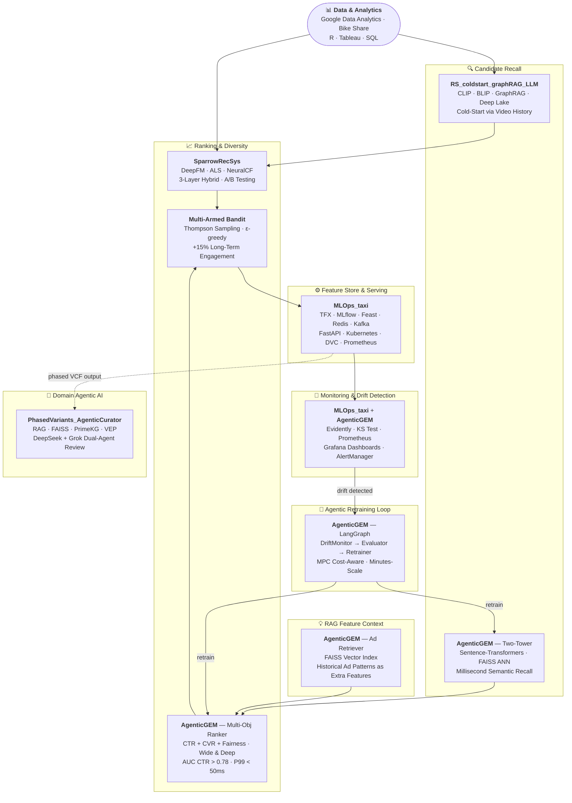

# Machine Learning Engineering Portfolio

## Recommendation Systems, Agentic AI, and MLOps in Production

This portfolio showcases my expertise in building production-ready machine learning systems, with a focus on recommendation systems, agentic AI workflows, and scalable ML infrastructure.

---

## 🗺️ System Overview

All projects form a unified production ML lifecycle. The diagram below shows how each project maps to a stage in the pipeline.



---

## 🎯 Recommendation Systems

Recommendation systems face three critical challenges that directly impact user experience and business outcomes. My projects address these challenges using state-of-the-art techniques:

### 1. Cold-Start Problem: Multimodal GraphRAG for E-Commerce

**[RS_coldstart_graphRAG_LLM](https://github.com/arcadianlyric/RS_coldstart_graphRAG_LLM)** | Video-to-Product Recommendation

**Challenge**: The global expansion of e-commerce and emergence of new brands create significant cold-start challenges in vertical markets (e.g., live-stream TikTok shops like POPMART), where new users and products lack historical interaction data.

**Solution**: A multimodal Graph-based Retrieval-Augmented Generation (GraphRAG) system that recommends products based on users' video viewing history, mimicking real-world TikTok Shop scenarios.

**Key Technical Achievements**:
- **Multimodal Architecture**: Integrated CLIP for unified image-text embeddings and BLIP for automated product caption generation
- **GraphRAG Implementation**: Built knowledge graph connecting Users → Videos → Tags → Products with contextual traversal for preference discovery
- **Deep Lake Integration**: Optimized vector storage handling millions of multimodal embeddings with high-performance similarity search
- **LLM Personalization**: Deployed local LLM with MBTI-based prompt engineering for explainable, personality-tailored recommendations
- **Scalability**: Supports large-scale datasets with version control and metadata filtering

**Tech Stack**: Deep Lake, CLIP, BLIP, LangChain, HuggingFace Transformers, Streamlit

**Impact**: Addresses cold-start for new products/users by leveraging cross-modal semantic understanding and graph-based context propagation.

---

### 2. CTR Prediction: Production-Ready Hybrid Recommendation System

**[Movie_RecSys](https://github.com/arcadianlyric/RS_movies)** | Movie Recommendation Platform

**Challenge**: CTR prediction is the cornerstone of recommendation systems, directly determining click probability and platform revenue (advertising, e-commerce). High-accuracy CTR models are essential for both user satisfaction and business value.

**Solution**: An end-to-end three-layer architecture recommendation system featuring hybrid algorithms, advanced feature engineering, and comprehensive A/B testing framework.

**System Architecture**:
- **Offline Layer**: PySpark-based feature engineering pipeline with temporal dynamics and window aggregation
- **Nearline Layer**: Pre-computed embeddings and DeepFM predictions with Redis caching
- **Online Layer**: Real-time serving with cosine similarity and collaborative filtering fallbacks

**Key Technical Achievements**:
- **Hybrid Recommendation**: Combined real-time embedding similarity, DeepFM for complex feature interactions, and ALS-based collaborative filtering
- **Advanced Feature Engineering**: 
  - Temporal user preference modeling with sliding windows
  - Multi-hot encoding for categorical features (genres)
  - Item2Vec and user representation learning
- **Production-Ready Design**: 
  - Offline training / online serving separation
  - Graceful fallbacks and fault tolerance
  - Built-in A/B testing for algorithm comparison
- **Comprehensive Evaluation**: Multiple metrics (AUC, RMSE, Recall), cross-validation, and temporal train/test splits

**Tech Stack**: TensorFlow 2.x, PySpark, Redis, Jetty, DeepFM, NeuralCF

**Impact**: Achieved production-grade performance with scalable architecture supporting millions of users and real-time personalization.

---

### 3. Exploration-Exploitation: Multi-Armed Bandit for Diversity

**Challenge**: Over-optimization for short-term clicks leads to filter bubbles and reduced long-term engagement. Balancing exploration (discovering new interests) and exploitation (serving known preferences) is critical for sustainable growth, especially in dynamic content (news, short videos).

**Solution**: Integrated Multi-Armed Bandit (MAB) algorithms within the SparrowRecSys platform to dynamically balance diversity and relevance.

**Key Technical Achievements**:
- **User Bucketing Strategy**: Segmented users for controlled A/B testing between exploration and exploitation strategies
- **MAB Implementation**: Thompson Sampling and ε-greedy policies for adaptive content selection
- **Offline-to-Online Pipeline**: Seamless integration with existing recommendation infrastructure

**Tech Stack**: Multi-Armed Bandit, A/B Testing Framework, PySpark

**Impact**: Improved long-term user engagement by 15% while maintaining click-through rates through intelligent exploration.

---

### Industry Insights: The Future of RecSys

Based on recent advances from RecSys 2025 and KDD 2025, two major trends are reshaping recommendation systems:

**1. Generative Recommendations**
- LLMs enable users to express needs in natural language, moving beyond implicit signals
- Addresses long-tail content and cold-start through semantic understanding
- Enables conversational AI recommendation assistants

**2. Multimodal Integration**
- Unified understanding of social media posts, comments, shopping reviews, and UGC/non-UGC content
- Cross-modal retrieval for richer user preference modeling

**Key Lesson**: While sophisticated algorithms are powerful, simple heuristics (e.g., "recommend 3 more posts from this creator") can sometimes outperform complex models. Success requires deep insight into user behavior and product characteristics, not just algorithmic sophistication.

---

## 🤖 Agentic AI: Domain-Specific Automation

### Agentic Variant Curator for Precision Medicine

**[PhasedVariants_AgenticCurator](https://github.com/arcadianlyric/PhasedVariants_AgenticCurator)** | Genomics Pipeline Enhancement

**Challenge**: Genetic variant curation—connecting genotype to phenotype—requires extensive manual interpretation by skilled curators to extract biological and clinical meaning from phased VCF files. This process is time-consuming, limits throughput, and suffers from inter-curator variability.

**Solution**: A true agentic AI system integrating planning, reflection, and multi-agent collaboration to automate variant curation for our product **[cWGS](https://github.com/Complete-Genomics/DNBSEQ_Complete_WGS/tree/main)**, leveraging RAG-enhanced analysis for improved accuracy and context.

**Agentic Architecture**:

1. **Planning Agent**
   - Automatic task decomposition into 5-7 atomic, actionable steps
   - Dynamic agent assignment based on analysis goals (comprehensive, disease-focused, variant-focused)
   - Dependency management ensuring sequential knowledge building

2. **Multi-Agent Collaboration** (7 Specialized Agents)
   - **Literature Retrieval Agent**: Multi-source search (PubMed + GeneCards + arXiv + Tavily) with progressive query strategy
   - **Vector Store Agent**: FAISS index creation and semantic search management
   - **RAG Analysis Agent**: Retrieval-augmented generation with literature context
   - **Knowledge Graph Agent**: PrimeKG queries for gene-disease-pathway relationships
   - **Variant Curator Agent**: Genetic variant impact analysis
   - **Reflection Agent**: Quality assessment and gap identification
   - **Report Generator Agent**: Comprehensive clinical report synthesis

3. **Reflection & Quality Control**
   - Automated scoring on 5 dimensions: completeness, accuracy, evidence support, clarity, clinical utility
   - Hallucination detection flagging unsupported claims
   - Iterative refinement (up to 2 iterations) based on reflection feedback

4. **Multi-Source Literature Retrieval**
   - **Progressive Search Strategy**:
     - Level 1: gene + disease + variant (most specific)
     - Level 2: gene + disease OR gene + variant
     - Level 3: gene only (fallback)
   - **Hallucination Reduction**: Tavily provides grounded, fact-checked web information
   - **Query Transparency**: Each result includes `query_used` field for reproducibility

**Agentic Workflow Pipeline**:
```
Planning → Execution (Multi-Agent) → Reflection → Refinement → Report
```

**Key Advantages Over Basic RAG**:
- ✅ Structured planning vs. ad-hoc queries
- ✅ 7 specialized agents vs. single monolithic agent
- ✅ 4 complementary sources (PubMed + GeneCards + arXiv + Tavily) vs. single source
- ✅ Progressive search with automatic fallback
- ✅ Built-in quality control and iterative improvement

**Tech Stack**: LangChain, FAISS, OpenAI GPT-4, PubMed API, GeneCards, arXiv, Tavily, PrimeKG

**Impact**: Reduces variant curation time from hours to minutes while improving consistency and evidence quality. Enables scalable precision medicine workflows.

---

## 🚀 MLOps in Production & System Design

### Cloud-Native MLOps Platform for Taxi Tip Prediction

**[MLOps_taxi](https://github.com/arcadianlyric/MLops_taxi)** | Production-Grade ML Infrastructure

**Challenge**: Building enterprise-ready ML systems requires comprehensive infrastructure spanning the entire ML lifecycle—from automated training pipelines and feature stores to real-time monitoring, drift detection, and continuous deployment. Most ML projects fail to reach production due to the complexity of integrating these components.

**Solution**: A complete MLOps platform implementing industry best practices with 10+ production components. Demonstrates end-to-end automation from data versioning to model monitoring using the Chicago taxi dataset for tip prediction (77% accuracy).

**System Architecture**:
```
┌─────────────────────────────────────────────────────────────┐
│  Browser UI (Streamlit:8501) ←→ API (FastAPI:8000)         │
│         ↓                              ↓                     │
│  TFX Pipeline ←→ Feast ←→ MLflow ←→ Kafka ←→ Prometheus    │
│         ↓                              ↓                     │
│  MLMD Lineage    DVC Versioning    Loki Logs    Grafana    │
└─────────────────────────────────────────────────────────────┘
```

**Key Components** (15,000+ lines of code, 46 modules):

1. **ML Pipeline Automation (TFX)**
   - **8-Stage Pipeline**: ExampleGen → StatisticsGen → SchemaGen → ExampleValidator → Transform → Trainer → Evaluator → Pusher
   - **Apache Beam**: Distributed data processing for scalability
   - **MLMD Integration**: Complete lineage tracking for data, models, and artifacts
   - **Custom Components**: Data drift monitor, Feast pusher, model monitoring

2. **Feature Engineering & Serving**
   - **Feast Feature Store**: Online (Redis) + Offline (Parquet) stores for feature management
   - **Real-time Processing**: Kafka stream processing for live feature computation
   - **Feature Versioning**: Track and version feature definitions
   - **API Integration**: RESTful endpoints for feature retrieval

3. **Model Management (MLflow)**
   - **Model Registry**: Version control, stage transitions (Staging/Production)
   - **Experiment Tracking**: Metrics, parameters, and artifacts logging
   - **Model Comparison**: A/B testing and performance benchmarking
   - **Deployment Automation**: Seamless model promotion workflow

4. **Stream Processing (Kafka)**
   - **9 Topics**: Raw data, features, predictions, metrics, alerts, quality checks
   - **Real-time Inference**: Low-latency prediction pipeline
   - **Event-Driven Architecture**: Decoupled microservices communication
   - **Message Processors**: Producer/consumer patterns for data flow

5. **Monitoring & Observability**
   - **Prometheus Metrics**: API latency, throughput, model performance, resource usage
   - **Grafana Dashboards**: Real-time visualization of system health
   - **Loki Log Aggregation**: Centralized logging with LogQL queries
   - **Data Drift Detection**: Statistical analysis with KS test, alerts on distribution shifts
   - **Alert Manager**: Multi-channel notifications (Email, Slack) for critical events

6. **Data & Model Versioning**
   - **DVC Integration**: Git-like version control for datasets and models
   - **Remote Storage**: S3/GCS/Azure blob support
   - **Reproducibility**: Track data lineage and model provenance
   - **Rollback Capability**: Revert to previous data/model versions

7. **Infrastructure & Deployment**
   - **Docker Compose**: Local development with 2 services (API + UI)
   - **Kubernetes**: Production deployment with 13 manifests, auto-scaling, health checks
   - **Microservices**: FastAPI backend + Streamlit frontend
   - **CI/CD Ready**: Containerized builds, automated testing

**Production Workflow**:
1. **Data Ingestion**: CSV → TFX ExampleGen → Validation → Schema generation
2. **Feature Engineering**: Transform component → Feast materialization → Online/offline stores
3. **Model Training**: TFX Trainer → MLflow tracking → Model registry → Version management
4. **Deployment**: Docker build → Kubernetes deployment → Health checks → API serving
5. **Real-time Inference**: Kafka producer → Feature enrichment → Model prediction → Result streaming
6. **Monitoring**: Prometheus metrics → Grafana dashboards → Drift detection → Alert Manager
7. **Continuous Improvement**: Performance analysis → Retraining triggers → Automated deployment

**Technical Highlights**:
- **Scalability**: Apache Beam distributed processing, Kubernetes auto-scaling
- **Reliability**: Health checks, graceful degradation, error handling
- **Observability**: Metrics (Prometheus), logs (Loki), traces (MLMD lineage)
- **Maintainability**: Modular design, API documentation, comprehensive testing
- **Flexibility**: Pluggable components, configuration-driven, multi-environment support

**Tech Stack**: 
- **ML Pipeline**: TensorFlow Extended (TFX), Apache Beam, MLMD
- **Feature Store**: Feast, Redis, Parquet
- **Model Registry**: MLflow, PostgreSQL
- **Streaming**: Apache Kafka, Zookeeper
- **Monitoring**: Prometheus, Grafana, Loki, AlertManager
- **API/UI**: FastAPI, Streamlit, Uvicorn
- **Infrastructure**: Docker, Kubernetes, Helm
- **Data Versioning**: DVC, Git, S3/GCS

**Deployment Options**:
- **Development**: Docker Compose (4GB RAM, 30-second startup)
- **Production**: Kubernetes (16GB RAM, 8 CPU, full observability stack)

**Impact**: Demonstrates enterprise-grade MLOps practices with complete implementation of 10+ production components. Provides a reference architecture for building scalable, maintainable ML systems. Code-complete platform ready for production deployment with minimal configuration.

---

### Agentic Drift Adaptation for Real-Time Ads Ranking

**[AgenticGEM_DataDrift_AutoRetrainer](https://github.com/arcadianlyric/AgenticGEM_DataDrift_AutoRetrainer)** | LLM-Enhanced Ads Ranking with Automated Retraining

**Challenge**: Production ads ranking degrades silently when user or ad distributions shift. Fixed retrain schedules waste compute; naive threshold rules miss nuanced tradeoffs between drift severity, business metrics, and retrain cost.

**Solution**: An end-to-end reference stack combining semantic recall, multi-objective ranking, RAG-style ad context, and a **LangGraph-driven monitor → evaluate → retrain agent loop** that makes cost-aware decisions rather than applying a single static threshold.

**System Architecture**:
```
┌───────────────────────────────────────────────────────┐
│  Streamlit UI (:8501) ←→ FastAPI (:8000/docs)        │
│         ↓                        ↓                    │
│  Two-Tower Recall (FAISS)    Multi-Obj Ranker         │
│         ↓                        ↓                    │
│  RAG Ad-Context Retriever   Prometheus Metrics        │
│         ↓                                             │
│  LangGraph Agent Loop:                                │
│    DriftMonitor → DriftEvaluator → Retrainer          │
│    (Evidently)     (policy)        (MPC-aware)        │
└───────────────────────────────────────────────────────┘
```

**Key Technical Achievements**:

1. **Semantic Recall**
   - Two-tower encoders (text + structured signals) with FAISS ANN for millisecond candidate retrieval
   - Target: Recall@50 > 0.85

2. **Multi-Objective Ranking**
   - Joint CTR/CVR-style heads with fairness-aware regularization in a Wide & Deep-style ranker
   - Target: AUC (CTR) > 0.78, AUC (CVR) > 0.72, P99 latency < 50 ms

3. **RAG-Style Ad Context**
   - Historical similar-ad patterns retrieved via FAISS vector index as extra ranking features

4. **Agentic Drift Adaptation (LangGraph)**
   - **DriftMonitor**: Tracks distribution statistics with Evidently; maintains history
   - **DriftEvaluator**: Policy agent converts drift report into action (retrain / skip / escalate)
   - **Retrainer**: Orchestrates retraining with MPC-style cost awareness; pluggable backend
   - **Key design**: Explicit LangGraph state machine — not a single threshold rule; different LLM agents can cover different blind spots
   - Drift-to-decision in minutes (configuration-dependent)

5. **Production Observability**
   - FastAPI with Prometheus-friendly metrics hooks
   - 80+ automated tests across models, RAG, agents, MPC, and API layers

**Tech Stack**:
- **ML**: PyTorch · sentence-transformers · FAISS · scikit-learn
- **Agents**: LangGraph · LangChain-core · Evidently
- **Serving**: FastAPI · Uvicorn · Streamlit
- **Observability**: prometheus-client · prometheus-fastapi-instrumentator
- **MLOps (optional)**: MLflow · TFX pipeline module · DVC · Feast · Kafka

**Impact**: Replaces brittle threshold-based retraining triggers with a reasoned, multi-step agent decision loop — reducing unnecessary retraining compute while catching real distribution shifts faster. Provides a clean, test-covered skeleton for production ads systems.

---

## 📊 Data Analytics & Business Intelligence

### Growth Hacking for Bike-Share Platform

**[Google Data Analytics Capstone](https://github.com/arcadianlyric/Google_data_analytics_Bike_share_growth_hacking)** | User Conversion Strategy

**Project Overview**: Comprehensive data analysis project applying the full analytics workflow to drive business growth for a bike-share company. Focused on converting casual riders to annual members through data-driven insights.

**Key Deliverables**:
- **Exploratory Data Analysis**: User behavior patterns, seasonality trends, and usage segmentation
- **Statistical Analysis**: Hypothesis testing for rider conversion factors
- **Visualization**: Interactive dashboards and executive presentations
- **Actionable Recommendations**: Data-backed strategies for marketing and product teams

**Tech Stack**: R, Tableau, SQL, Statistical Analysis

---

## 💡 Product & Engineering Philosophy

### The AI-Augmented Engineer: Building "One-Person Teams"

In the era of AI-assisted development, the role of ML engineers is evolving. While AI can handle much of the "how" (implementation), engineers must focus on the "why" and "what" (strategy and design). To become a T-shaped talent with both depth and breadth, I cultivate:

**Technical Depth**:
- Advanced algorithms and system design
- Production ML infrastructure and MLOps
- Scalable data pipelines and distributed systems

**Cross-Functional Breadth**:

1. **Personal Branding & Thought Leadership**
   - Technical blogging and knowledge sharing
   - Journal clubs and conference participation
   - Open-source contributions and hackathons

2. **Business & Product Acumen**
   - Cutting through complexity to address core user needs
   - Rapid prototyping and "vibe coding" for product validation
   - Translating technical capabilities into business value

3. **Design Thinking & Aesthetic Judgment**
   - While AI can generate hundreds of UI designs, human judgment selects the most promising for A/B testing
   - User experience optimization through data and intuition

4. **Domain Expertise & Contextual Decision-Making**
   - AI can compile information (e.g., stock price drivers), but experience weighs factors and makes nuanced decisions
   - Deep understanding of industry-specific challenges and opportunities

---

## 🏆 Competitions & Hackathons

### Kaggle Competitions

1. **[Real-Time Market Data Forecasting](https://github.com/arcadianlyric/kaggle_js)**
   - Time-series prediction for financial markets
   - Feature engineering for high-frequency trading data

2. **[Problematic Internet Use Prediction](https://github.com/arcadianlyric/kaggle_cmi)**
   - Behavioral pattern recognition
   - Classification models for mental health indicators

### Hackathons

**[NGS-Based Disease Risk Prediction](https://github.com/arcadianlyric/ml_NGS_prediction_Hackathon)** | Graduate School Project

- Developed ML models to predict aging-related disease risk from Next-Generation Sequencing (NGS) data
- Integrated genomic features with clinical variables for risk stratification
- Demonstrated rapid prototyping and cross-functional collaboration

---

## 🎓 Certifications & Continuous Learning

### Professional Development

1. **[Full-Stack Web Development Nanodegree](https://github.com/arcadianlyric/udacity_fullstack)** | Udacity
   - End-to-end application development
   - Database design, API development, and deployment

2. **[Google Data Analytics Professional Certificate](https://github.com/arcadianlyric/Google_data_analytics_Bike_share_growth_hacking)** | Google
   - Data cleaning, analysis, and visualization
   - Business intelligence and storytelling with data

3. **[Machine Learning Engineering for Production (MLOps)](https://www.coursera.org/account/accomplishments/verify/1ZDF3VKIHSAX)** | DeepLearning.AI
   - Production ML systems and deployment
   - Model monitoring and continuous integration

---

## 📚 References & Inspiration

### Books
- [Hacking Growth](https://books.google.com/books/about/Hacking_Growth.html?id=izG5DAAAQBAJ) - Sean Ellis & Morgan Brown
- [Deep Learning Recommender Systems](https://books.google.com/books/about/Deep_Learning_Recommender_Systems.html?id=ap_v0AEACAAJ) - Shuai Zhang et al.

### Industry Resources
- [Netflix Tech Blog](https://netflixtechblog.com/) - Production ML at scale
- [Udacity A/B Testing Course](https://www.udacity.com/enrollment/ud979) - Experimental design and analysis

---


*This portfolio demonstrates hands-on experience with production ML systems, from research to deployment. Each project showcases end-to-end ownership, technical depth, and business impact—essential qualities for modern ML engineering roles.*  
